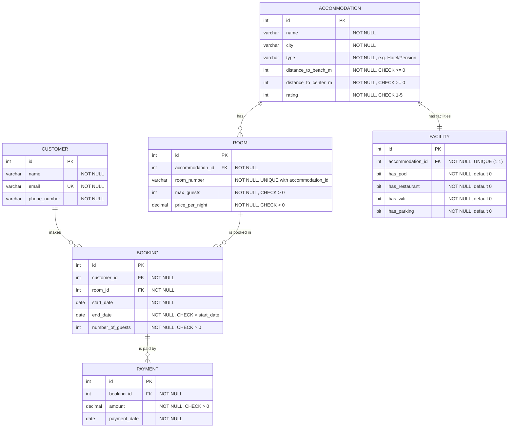

# Holiday Maker – Group ER diagram

```mermaid
erDiagram
    CUSTOMER ||--o{ BOOKING : makes
    ROOM ||--o{ BOOKING : "is booked in"
    BOOKING ||--o{ PAYMENT : "is paid by"
    ACCOMMODATION ||--o{ ROOM : has
    ACCOMMODATION ||--|| FACILITY : "has facilities"

    CUSTOMER {
        int id PK
        varchar name "NOT NULL"
        varchar email UK "NOT NULL"
        varchar phone_number "NOT NULL"
    }
    ACCOMMODATION {
        int id PK
        varchar name "NOT NULL"
        varchar city "NOT NULL"
        varchar type "NOT NULL, e.g. Hotel/Pension"
        int distance_to_beach_m "NOT NULL, CHECK >= 0"
        int distance_to_center_m "NOT NULL, CHECK >= 0"
        int rating "NOT NULL, CHECK 1-5"
    }
    FACILITY {
        int id PK
        int accommodation_id FK "NOT NULL, UNIQUE (1:1)"
        bit has_pool "NOT NULL, default 0"
        bit has_restaurant "NOT NULL, default 0"
        bit has_wifi "NOT NULL, default 0"
        bit has_parking "NOT NULL, default 0"
    }
    ROOM {
        int id PK
        int accommodation_id FK "NOT NULL"
        varchar room_number "NOT NULL, UNIQUE with accommodation_id"
        int max_guests "NOT NULL, CHECK > 0"
        decimal price_per_night "NOT NULL, CHECK > 0"
    }
    BOOKING {
        int id PK
        int customer_id FK "NOT NULL"
        int room_id FK "NOT NULL"
        date start_date "NOT NULL"
        date end_date "NOT NULL, CHECK > start_date"
        int number_of_guests "NOT NULL, CHECK > 0"
    }
    PAYMENT {
        int id PK
        int booking_id FK "NOT NULL"
        decimal amount "NOT NULL, CHECK > 0"
        date payment_date "NOT NULL"
    }
```